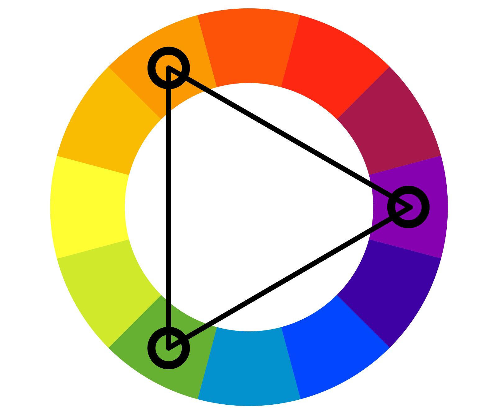

# Apresentação do CardGenerator v3

## O que mudou em relação ao v2?

O código sofreu diversas mudanças, principalmente na geração do SVG na classe `SvgTemplate` e com a criação de duas novas classes: `TemplateColors` e `ColorsUtils`.

No SvgTemplate, foi adicionada a lógica para inserção dos ícones de maneira aleatória a cada vez que o código for executado e a inserção das cores recebidas pelo `TemplateColors` no SVG criado.

## `TemplateColors.java`

### Construtor

Essa classe foi criada com o intuito de facilitar a utilização das cores geradas, ela possui um construtor que não recebe parâmetro algum,
ela gera seus próprios valores para serem utilizados depois:

```java
public TemplateColors() {
    Color color = ColorUtils.generateRandomColor();
    Color[] colors = ColorUtils.generateTriadColor(ColorUtils.mixColors(color, new Color(200, 200, 200)));
    this.primary = colors[0];
    this.secondary = ColorUtils.getComplementary(colors[0]);
    this.accent1 = colors[1];
    this.accent2 = colors[2];
    this.textTop = ColorUtils.getComplementary(colors[1]);
    this.textBottom = ColorUtils.getComplementary(colors[2]);
}
```

Este construtor está chamando nossa classe auxiliar `ColorsUtils` e criando uma nova cor RGB aleatória, depois disso ela chama a função `generateTriadColor` que recebe uma cor como parâmetro, porém neste caso estou passando a função `mixColors` para misturar a cor criada aleatoriamente com uma cor bem clara, para gerar paletas de cores mais claras.

A função responsavel por criar a paleta, `generateTriadColor` retorna um vetor com as 3 cores que serão utilizadas, a primária sendo a criada aleatóriamente, a accent1 e a accent2, sendo essas 3 parte de uma tríade de cores.

A cor secundária é a cor complementar da primária, e as cores dos textos são as complementares da accent1 e accent2.

### Getters

Os getters dessa classe são um pouco diferentes, eles não informam o valor real guardado na classe, eles passam o valor de Color do java, para uma String da cor em Hexadecimal:

```java
public String getPrimary() {
    return ColorUtils.toHex(primary);
}
```

Eu fiz dessa maneira pois o svg trabalha com strings em hexadecimal, não em padrão Color do java.

## `ColorUtils.java`

Essa é a classe auxiliar que criei para realizar a lógica de criação das cores, ela é a responsável por realizar todos os cálculos relacionados às cores, como um exemplo a lógica de criação da cor aleatória e a tríade:

```java

public static float[] getHSB(Color c) {
    return Color.RGBtoHSB(c.getRed(), c.getGreen(), c.getBlue(), null);
}

public static Color generateRandomColor() {
    Random rand = new Random();
    int r = rand.nextInt(255);
    int g = rand.nextInt(255);
    int b = rand.nextInt(255);
    return new Color(r, g, b);
}

public static Color[] generateTriadColor(Color c) {
    float[] hsbColor = getHSB(c);
    float hue = hsbColor[0];
    float saturation = hsbColor[1];
    float brightness = hsbColor[2];

    float p, s, t;
    p = hue;
    s = (hue + 1f/3f) % 1f;
    t = (hue + 2f/3f) % 1f;

    int primary = Color.HSBtoRGB(p, saturation, brightness);
    int secondary = Color.HSBtoRGB(s, saturation, brightness);
    int tertiary = Color.HSBtoRGB(t, saturation, brightness);

    return new Color[]{new Color(primary), new Color(secondary), new Color(tertiary)};
}
```

A função `generateTriadColor` recebe uma cor c, transforma ela de RGB para HSB, outro padrão de cor que ao invés de red, green e blue, utiliza de hue, saturation e brightness (matiz, saturação e brilho), o que é importante para o cálculo das cores que serão utilizadas,
pois hue ou matiz em português, é o valor necessario para fazer o cálculo dar certo, pois para construir uma tríade de cores
é necessário que cada cor esteja a 120º uma da outra no espectro.



## Alguns cards gerados

||
|------------------------------------------------|-------------------------------------|
|| |


## Pontos difíceis e fáceis

| Fáceis                                     | Difíceis                              |
|--------------------------------------------|---------------------------------------|
| Criar a Classe `TemplateColors`            | Entender como gerar a tríade de cores |
| Editar a `Main` para funcionar com o resto | Fazer os ícones funcionarem no svg    |

## Código Rodando


https://github.com/user-attachments/assets/699c01f7-4bd4-4884-99dd-7f1c020bb7bd

## Referências

- https://customstickers.com/community/blog/how-to-calculate-complementary-triadic-and-tetradic-colors-from-a-hex-code?srsltid=AfmBOopFMCzjUfUNDb4tqRaeQJgdkMCQJejoqCI3sWNHstuvRz0SqLTg
- https://stackoverflow.com/questions/3607858/convert-a-rgb-color-value-to-a-hexadecimal-string
- https://stackoverflow.com/questions/43044/algorithm-to-randomly-generate-an-aesthetically-pleasing-color-palette
- https://www.sessions.edu/color-calculator/
- https://en.wikipedia.org/wiki/Color_theory
- https://en.wikipedia.org/wiki/Complementary_colors
- https://pt.wikipedia.org/wiki/C%C3%ADrculo_crom%C3%A1tico
